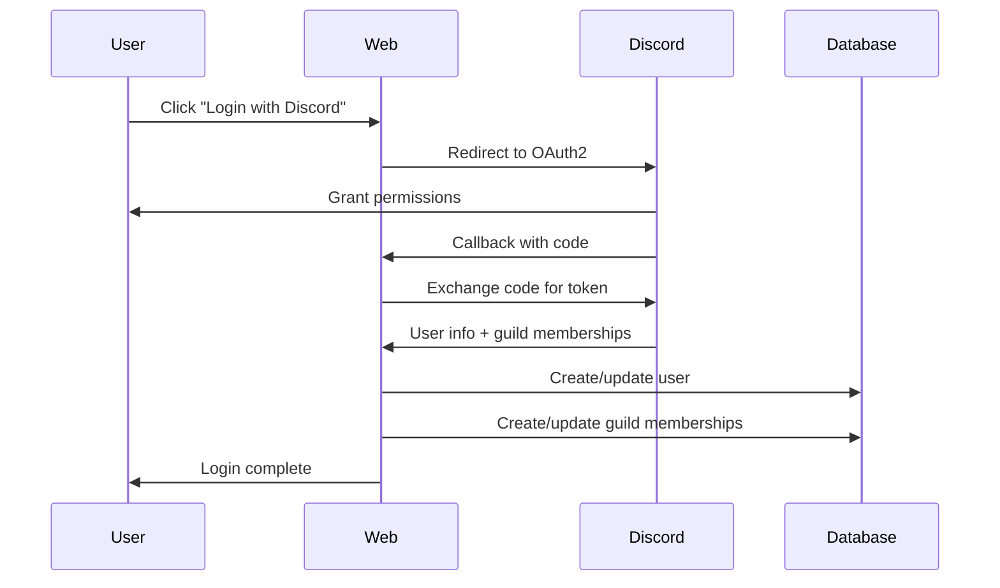

# Discord OAuth Integration Plan

## Architecture Overview

Our new separated schema perfectly supports Discord OAuth with clean separation of concerns:

### **Schema Components**
- **Users**: Identity only (discord_id, name, active, banned)
- **Guilds**: Discord server configuration and permissions
- **UserGuildMemberships**: User-guild relationships with role mappings
- **PlayerEffectiveMMR**: Current game performance per guild
- **PlayerHistoricalMMR**: Audit trail of MMR changes

## Discord OAuth Flow

### **1. Discord Application Setup**
```
Application Type: Bot + OAuth2
OAuth2 Scopes: identify, guilds
Bot Permissions: View Channels, Send Messages
Redirect URI: https://your-domain.com/auth/discord/callback
```

### **2. User Authentication Flow**



### **3. Implementation Components**

#### **A. Auth Handler (`internal/handlers/auth_handler.go`)**
```go
type AuthHandler struct {
    userRepo       *repositories.UserRepository
    guildRepo      *repositories.GuildRepository
    membershipRepo *repositories.UserGuildMembershipRepository
    discordClient  *DiscordClient
}

// Routes:
// GET  /auth/discord        - Start OAuth flow
// GET  /auth/discord/callback - Handle OAuth callback
// POST /auth/logout         - Logout user
// GET  /auth/me             - Get current user info
```

#### **B. Discord Client (`internal/services/discord_client.go`)**
```go
type DiscordClient struct {
    clientID     string
    clientSecret string
    redirectURI  string
}

// Methods:
// GetOAuthURL() string
// ExchangeCode(code string) (*TokenResponse, error)
// GetUserInfo(token string) (*DiscordUser, error)
// GetUserGuilds(token string) ([]*DiscordGuild, error)
// GetGuildMember(token, guildID string) (*DiscordMember, error)
```

#### **C. Session Management (`internal/middleware/auth_middleware.go`)**
```go
type AuthMiddleware struct {
    userRepo *repositories.UserRepository
}

// Middleware functions:
// RequireAuth() - Ensure user is logged in
// RequireGuildMembership(guildID) - Ensure user is in guild
// RequirePermission(permission) - Ensure user has permission
```

## Database Operations

### **User Creation/Update Flow**
```go
// 1. OAuth callback receives Discord user info
discordUser := &DiscordUser{
    ID:       "123456789012345678",
    Username: "player123",
    // ... other fields
}

// 2. Create or update user
user, err := userRepo.CreateOrUpdateUser(models.UserCreateRequest{
    DiscordID: discordUser.ID,
    Name:      discordUser.Username,
    Active:    true,
    Banned:    false,
})

// 3. For each guild the user is in:
for _, discordGuild := range userGuilds {
    // Ensure guild exists
    guild, err := guildRepo.CreateOrFindGuild(discordGuild.ID, discordGuild.Name)
    
    // Get user's roles in this guild
    member, err := discordClient.GetGuildMember(token, discordGuild.ID)
    
    // Create/update membership
    membership, err := membershipRepo.CreateOrUpdateMembership(models.UserGuildMembershipCreateRequest{
        UserID:       user.ID,
        GuildID:      guild.ID,
        DiscordRoles: member.Roles,
        Active:       true,
    })
    
    // Create initial MMR record if needed
    if !hasExistingMMR(user.ID, guild.ID) {
        mmrRepo.CreateInitialMMR(user.ID, guild.ID)
    }
}
```

## Permission Integration

### **Updated Permission Service**
```go
func (s *PermissionService) GetUserPermissions(userID, guildID int64) UserPermissions {
    // Get user's membership in this guild
    membership, err := s.membershipRepo.GetMembership(userID, guildID)
    if err != nil || !membership.Active {
        return UserPermissions{} // No access
    }
    
    // Get guild config to map Discord roles to USL permissions
    guildConfig, err := s.guildRepo.GetConfig(guildID)
    if err != nil {
        return UserPermissions{}
    }
    
    // Check if user's Discord roles grant permissions
    permissions := UserPermissions{}
    
    for _, userRole := range membership.DiscordRoles {
        if guildConfig.HasAdminRole([]string{userRole}) {
            permissions.IsAdmin = true
            permissions.CanAddUsers = true
            permissions.CanAddTrackers = true
            permissions.CanRunAdminCommands = true
            permissions.CanManageConfig = true
        } else if guildConfig.HasModeratorRole([]string{userRole}) {
            permissions.IsModerator = true
            permissions.CanAddUsers = true
            permissions.CanAddTrackers = true
        }
    }
    
    return permissions
}
```

## Implementation Steps

### **Phase 1: Core OAuth (Week 1)**
1. Create Discord OAuth application
2. Implement basic auth handler (login/callback/logout)
3. Create Discord client service
4. Add session management middleware

### **Phase 2: User & Guild Sync (Week 2)**
1. Implement user creation/update from Discord
2. Implement guild auto-creation from Discord
3. Implement user-guild membership sync
4. Add membership repository with CRUD operations

### **Phase 3: Permission Integration (Week 3)**
1. Update permission service to use membership data
2. Integrate Discord role -> USL permission mapping
3. Add middleware for permission checking
4. Update existing handlers to use new permission system

### **Phase 4: MMR Integration (Week 4)**
1. Auto-create initial MMR records for new users
2. Update MMR calculation to work with guild-specific data
3. Add historical tracking for MMR changes
4. Update existing MMR workflows

## Configuration Requirements

### **Environment Variables**
```env
DISCORD_CLIENT_ID=your_client_id
DISCORD_CLIENT_SECRET=your_client_secret
DISCORD_REDIRECT_URI=http://localhost:8080/auth/discord/callback
SESSION_SECRET=your_session_secret
```

### **Guild Configuration Update**
```json
{
  "discord": {
    "announcement_channel_id": "channel_id_here",
    "leaderboard_channel_id": "channel_id_here", 
    "bot_command_prefix": "!usl"
  },
  "permissions": {
    "admin_role_ids": ["admin_role_id"],
    "moderator_role_ids": ["mod_role_id"]
  }
}
```

## Testing Strategy

### **Unit Tests**
- Discord client methods
- Auth handler functions
- Permission service logic
- Repository CRUD operations

### **Integration Tests**
- Full OAuth flow (mocked Discord API)
- User/guild creation workflow
- Permission checking with real database
- Session management

### **Manual Testing**
- Real Discord OAuth flow
- Multiple guild memberships
- Role permission mapping
- Session persistence

## Security Considerations

### **OAuth Security**
- Validate state parameter to prevent CSRF
- Use HTTPS for all OAuth redirects
- Store tokens securely (encrypted sessions)
- Implement token refresh logic

### **Permission Security**
- Always check guild membership before granting access
- Fail secure on permission errors
- Log permission changes for audit
- Rate limit OAuth endpoints

### **Data Privacy**
- Only store necessary Discord data
- Provide user data deletion endpoints
- Respect Discord ToS regarding data usage
- Implement proper session timeout

This architecture provides a clean, scalable foundation for Discord OAuth integration while maintaining separation of concerns and supporting multiple guilds per user.